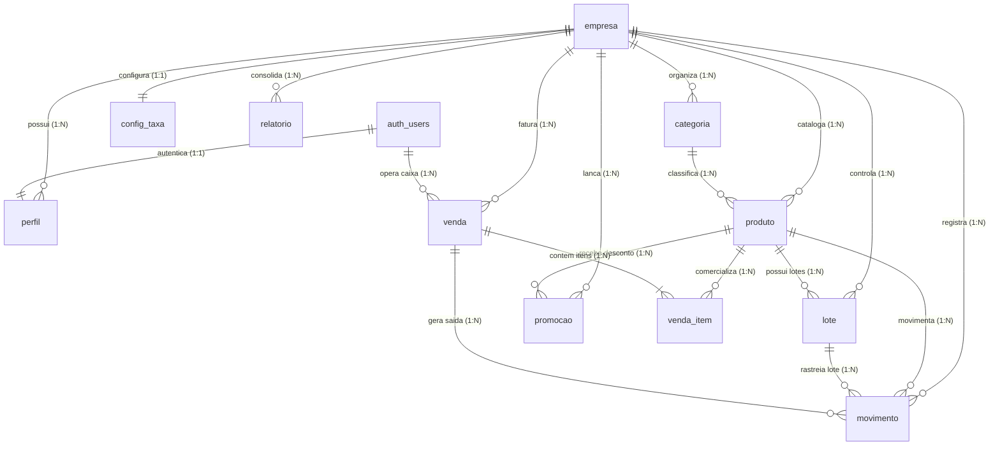

# Mapa de Relações do Banco de Dados (Schema Map)

> **Sistema:** Mercado Aparecida  
> **Backend:** Supabase PostgreSQL  

---

## 1. Visão Geral das Relações



---

## 2. Mapa Estruturado por Núcleo de Domínio

### 2.1 Núcleo de Identidade e Multi-Tenancy
* **`empresa` (Raiz Multi-tenant)**
  * `id` (UUID PK)
  * Representa o locatário/mercado independente.
  * Todas as tabelas filhas possuem chave estrangeira `empresa_id REFERENCES empresa(id) ON DELETE CASCADE`.
* **`perfil` (Membros da Loja)**
  * `id` (UUID PK -> `auth.users.id`)
  * `empresa_id` (FK -> `empresa.id`)
  * `papel`: `'dono'` (acesso irrestrito) ou `'operador'` (focado em frente de caixa).

---

### 2.2 Núcleo de Catálogo e Produtos
* **`categoria`**
  * `id` (UUID PK)
  * `empresa_id` (FK)
  * `nome` (Ex: Mercearia, Laticínios, Bebidas, Limpeza).
* **`produto`**
  * `id` (UUID PK)
  * `empresa_id` (FK)
  * `categoria_id` (FK -> `categoria.id`, nullable)
  * `ean` (Código de barras para scanner PDV)
  * `nome`, `unidade` (`'un'` ou `'kg'`), `custo`, `preco`, `estoque_minimo`, `perecivel`, `ativo`.

---

### 2.3 Núcleo de Estoque e Rastreabilidade
* **`lote` (Validade e Entregas)**
  * `id` (UUID PK)
  * `empresa_id` (FK)
  * `produto_id` (FK -> `produto.id`)
  * `validade` (Date)
  * `custo` (Custo específico deste lote)
* **`movimento` (Ledger Contábil de Estoque)**
  * `id` (UUID PK)
  * `empresa_id` (FK)
  * `produto_id` (FK -> `produto.id`)
  * `lote_id` (FK -> `lote.id`, nullable)
  * `tipo`: `'entrada'` (+), `'venda'` (-), `'perda'` (-), `'ajuste'` (+/-), `'devolucao'` (+)
  * `quantidade` (Numérico decimal com precisão para pesagem)
  * `ref_id` (ID da venda de origem ou número da nota fiscal de compra)
* **View Virtual: `v_estoque`**
  * Não armazena dados físicos; consolida `SUM(movimento)` por produto para garantir que o saldo nunca sofra corrupção por escrita concorrente.

---

### 2.4 Núcleo de Vendas e Caixa (PDV)
* **`venda` (Cupom / Transação)**
  * `id` (UUID PK)
  * `empresa_id` (FK)
  * `operador_id` (FK -> `auth.users.id`)
  * `total` (Valor líquido final recebido)
  * `custo_total` (Custo somado das mercadorias vendidas para apuração de lucro)
  * `desconto` (Desconto concedido na venda)
  * `forma_pagamento`: `'dinheiro'`, `'pix'`, `'debito'`, `'credito'`
  * `taxa` (Valor retido pela maquininha conforme `config_taxa`)
* **`venda_item`**
  * `id` (UUID PK)
  * `venda_id` (FK -> `venda.id`)
  * `produto_id` (FK -> `produto.id`)
  * `quantidade`, `preco_unit`, `custo_unit`, `desconto_unit`, `desconto_origem` (`'promocao'`, `'caixa'`, `'ambos'`).

---

### 2.5 Núcleo Comercial e Parâmetros
* **`promocao`**
  * `id` (UUID PK)
  * `empresa_id` (FK)
  * `produto_id` (FK -> `produto.id`)
  * `percentual` (% de desconto)
  * `inicio` e `fim` (Vigência da queima de estoque)
* **View Virtual: `v_preco_atual`**
  * Combina o preço base do `produto` com a melhor promoção ativa hoje.
* **`config_taxa`**
  * `empresa_id` (FK UNIQUE -> 1 linha por loja)
  * Percentuais de taxa de cartão e teto de desconto que o operador pode conceder sem senha de gerente.
* **`relatorio`**
  * `empresa_id` (FK)
  * `tipo` (`'diario'`, `'semanal'`, `'mensal'`)
  * Cache dos insights e métricas consolidadas pelo Gemini.

---

## 3. Fluxos de Dados no Sistema

```
1. ENTRADA DE NOTA FISCAL (DANFE / COMPRAS):
   Nota Fiscal XML/PDF 
   → Extração de Itens (Gemini)
   → Inserção de novos produtos em 'produto'
   → Inserção de lotes com validade em 'lote'
   → Inserção de 'movimento' (tipo: 'entrada')
   → Saldo atualizado automaticamente em 'v_estoque'

2. VENDA NO CAIXA (PDV):
   Leitura de EAN 
   → Consulta em 'produto' + 'v_preco_atual' + 'v_estoque'
   → Adição ao carrinho
   → Execução da RPC 'fechar_venda'
       ├── Inserção em 'venda'
       ├── Inserção em 'venda_item'
       └── Inserção em 'movimento' (tipo: 'venda')
   → Atualização instantânea de faturamento e estoque

3. CONTROLE DE PERDAS E VENCIMENTOS:
   Lote identificado no módulo Validade
   → Registro de perda em 'movimento' (tipo: 'perda')
   → Custo abatido na apuração de lucro líquido no Painel/Financeiro
```
